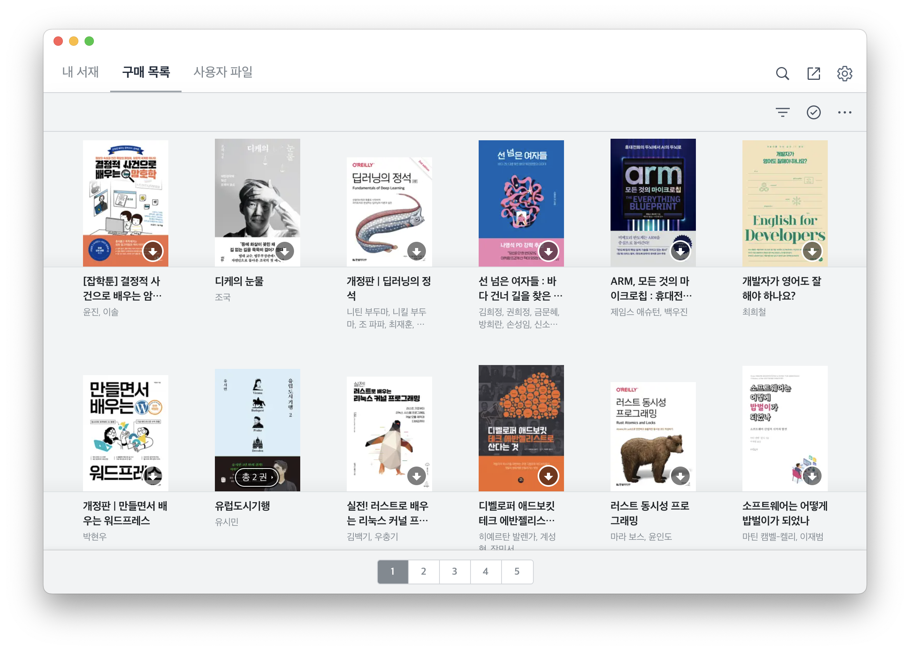
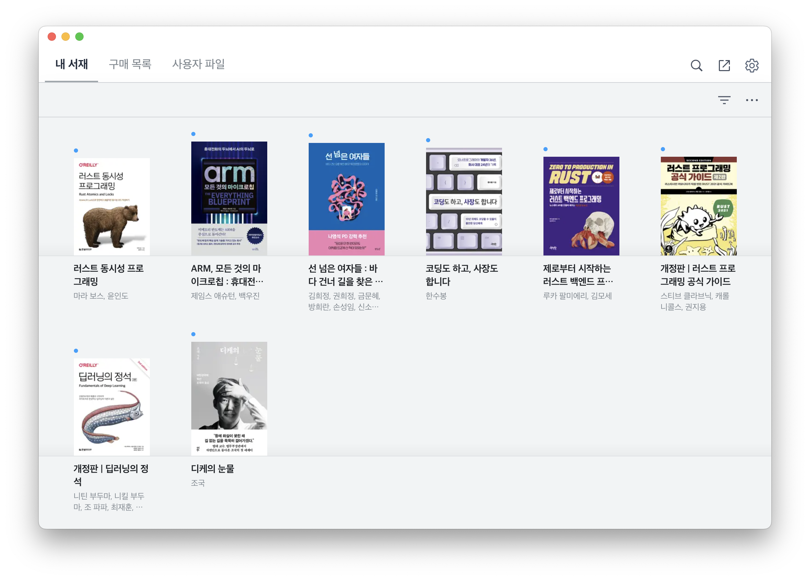

# Buy from Ridi, Read Anywhere!

`ridiculous` is a command-line interface tool that extracts the ebooks you've purchased from [Ridi](https://ridi.com/) and converts them into DRM-free files, enabling you to read them with your preferred ebook readers. It currently only supports EPUB and PDF formats.

> **Disclaimer**
>
> All goods obtained through the use of this software must not be shared with, distributed to, or sold for any purpose to others, in any form, under any circumstances. Any consequences resulting from the violation of this provision are solely your responsibility, and the developers of this software bear no responsibility whatsoever. Use at your own risk!

## Prerequisites

To use `ridiculous`, you need the following:

* [Ridi App](https://ridibooks.com/support/app/download)
* [Rust Development Environment](https://rustup.rs/)

## How to Use

1. Run the Ridi app installed on your computer.

  

2. Download the books you want from the purchases screen.

  

3. Open a broswer, go to https://ridibooks.com/account/login and log in.

4. After successfully logging in, go to https://account.ridibooks.com/api/user-devices/app to get the device information. Then, in the JSON result to this, find and write down the values of the fields `device_id` and `user_idx`.

    

3. Clone, build, and run `ridiculous` with these two values.

    

## References

* https://github.com/disjukr/ridi-drm-remover
* https://github.com/sidsidanf/ridi-decrypt
* https://www.bpak.org/blog/2018/04/리디북스-자신이-소유한-책-drm-해제하기-feat-위험한-비밀/
* https://www.bpak.org/blog/2019/05/리디북스-drm-해제하기-한번-더-ft-riberty/
